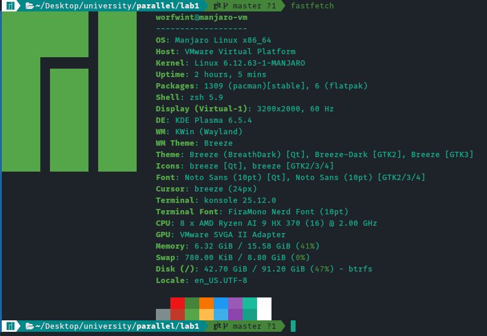
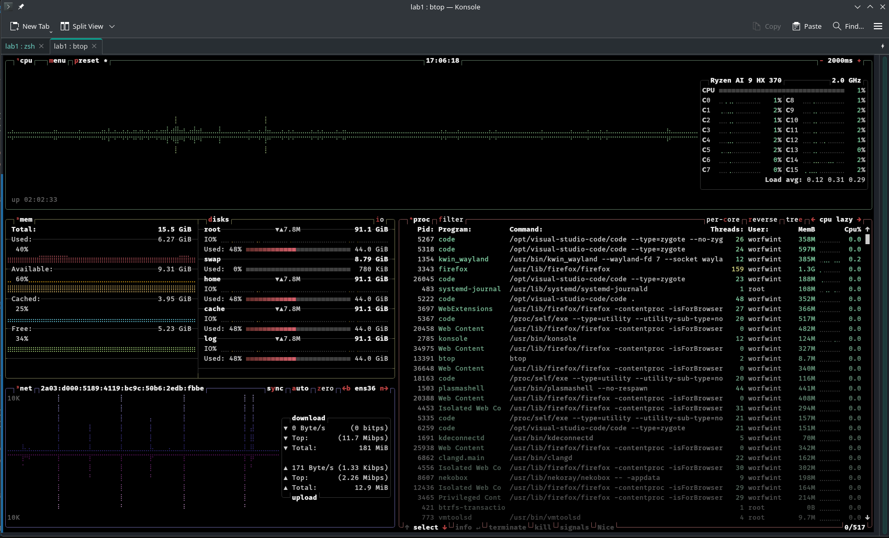
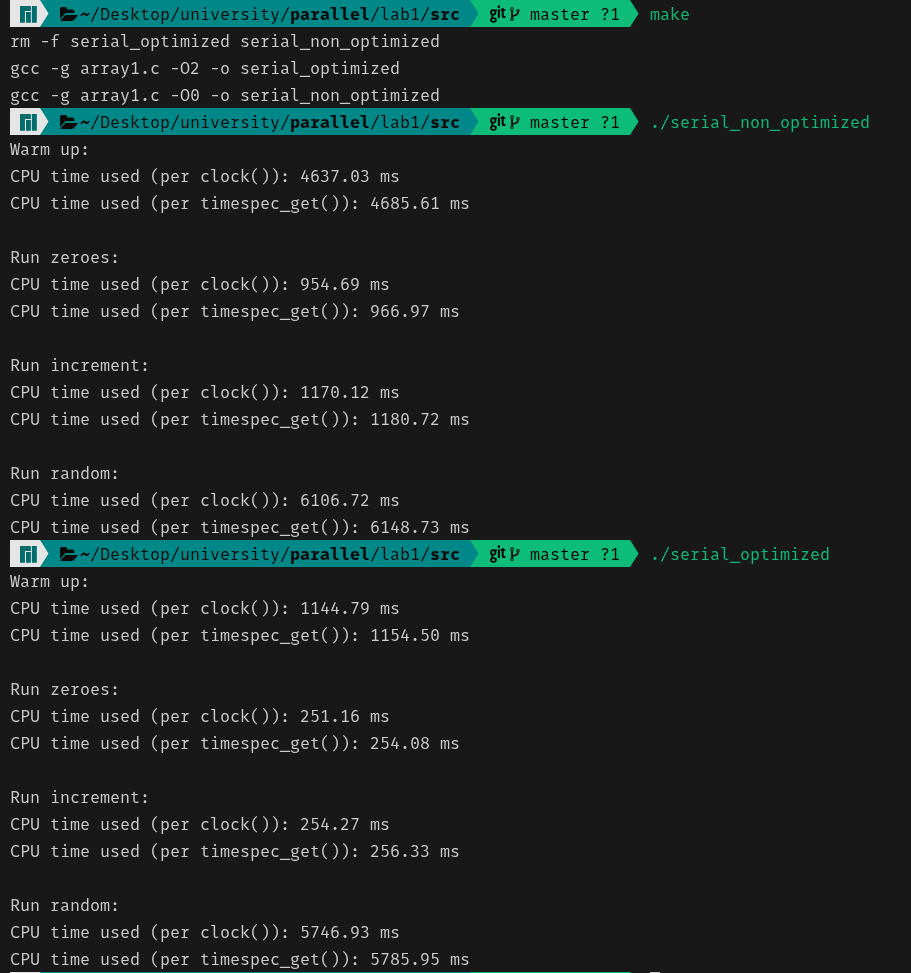

# Лабораторная работа №1. Введение

Выполнил студент группы 609-21
 Худолеев Михаил

## Ход работы

#### Вычислительные мощности

Работа выполнена на виртуальной машине со следующими параметрами:

 *Параметры виртуальной машины*

 *Параметры системы на момент проведения экспериментов*

На момент проведения экспериментов ноутбук был подключен к сети, чтобы обеспечить полную стабильную мощность работы процессора.

#### Результаты эспериментов

| | serial optimized | serial non optimized | non serial optimized | non serial non optimized |
|---|---|---|---|---|
| warm-up | 1144.79 ms | 4637.03 ms | | |
| run zeroes | 251.16 ms | 954.69ms | | |
| run increment | 254.27 ms | 1170.12 ms | | |
| run random | 5746.93 ms | 6106.72 ms | | |

*Сводная таблица с результатами экспериментов*

 *Результаты экспериментов для построкового заполнения матрицы*

